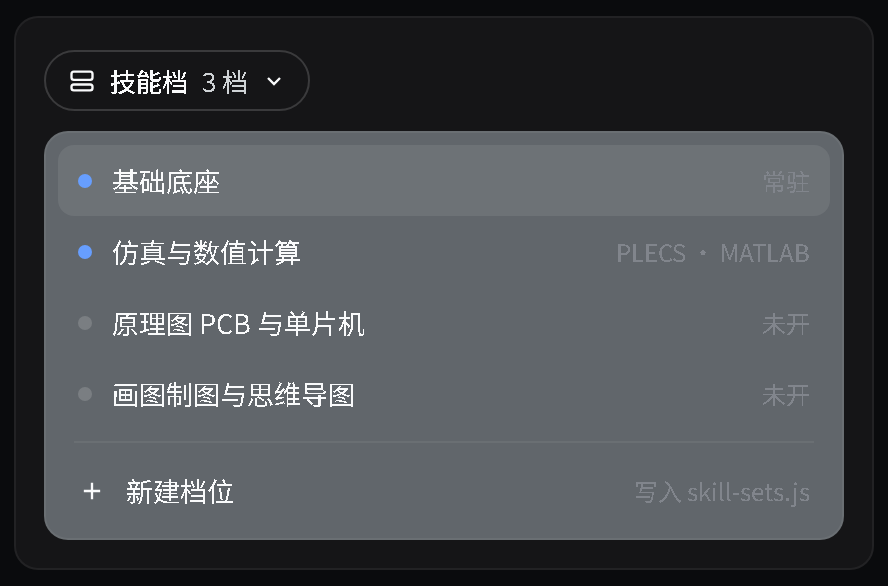

# dsh-skill-sets

[中文](README.md) · English



*Mockup: layout rendered from the official theme tokens, not a screenshot of a running instance.*

Groups skills into "sets" by task type: switching a set swaps the skill list loaded for that session, hiding every other skill both in the catalog and at the body level. A row of set pills sits above the composer, and the active sets persist per session.

## Install

```sh
dsh plugin --profile web add file:<this repo>
```

Restart the web instance afterwards.

Set definitions live in `lib/skill-sets.js` — set names, hints, member skills and the brief text are all there. After editing, re-sync to `~/.dsh/profiles/web/node_modules/dsh-skill-sets` and restart.

## Environment

| Variable | Default | Purpose |
|---|---|---|
| `DSH_SKILLSETS_DIAG` | `~/.dsh/logs/skill-sets-deny.log` | Diagnostic log for tool-surface trimming |
