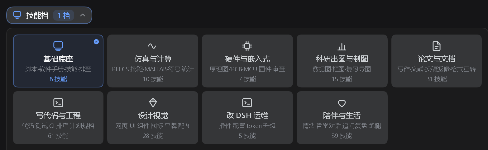

# dsh-input-suite

[中文](README.md) | English

Composer area: skill sets

## Packages

| Directory | What it does |
|---|---|
| `dsh-skill-sets` | Group skills into task-type sets; switching a set swaps the injected skill list |

## Install

```sh
# one package
dsh plugin --profile web add file:<this repo>/dsh-skill-sets
```

Or install the whole family on Windows PowerShell:

```powershell
./install.ps1
```

Restart the web instance afterwards. Each package directory carries its own README.

## Screenshots



## License

MIT
